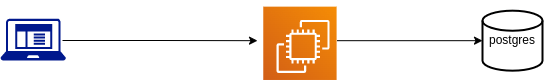

# Bank Server

Backend Server for a bank Infrastructure (Go and Postgres)

## Things to do

- [x] Design Database Schema
      
- [x] Create a postgres instance using docker and docker volume
      using `docker-compose.yaml` file
- [x] Connect to a Postgres instance
- [x] Create Tables In DB using sql file
      Future Improvements:
  - [ ] use SQLC to make queries
- [x] Make CRUD API for accounts table
- [x] Write Unit test for the API's
- [x] Dockerize (create a docker image) for the go app and db
      [See Dockerfile here](Dockerfile)
- [ ] Create Docker Network to let the image connect with the db
      `docker network create bank-network`
      `docker network connect bank-network postgres12`
- [x] Create CI using Github Actions on master branch
- [x] Deploy the image in minikube locally

- [x] Current Cloud Architecture
      \
       

- [x] Write Unit Tests by using Mock to mock DB.

- [ ] Handle Transactions
- [ ] Deploy on Kubernetes using AWS EKS
- [ ] Setup Monitoring Using Prometheus
- [ ] Read env variables from config file

- [ ] Connect to Kubernetes Control Plane Cluster via kubeconfig yaml file
- [ ] Using [Lens IDE](https://k8slens.dev) for managing the cluster
- [ ] Writing Validation rules using [Datree](https://datree.io/)
- [ ] install Prometheus for monitoring

### Things I am learned from this project

- Why we need a docker
- Why we need Kubernetes
- Creating a docker image
- Dockerfile
- Docker Network
- Deploying to Kubernetes
