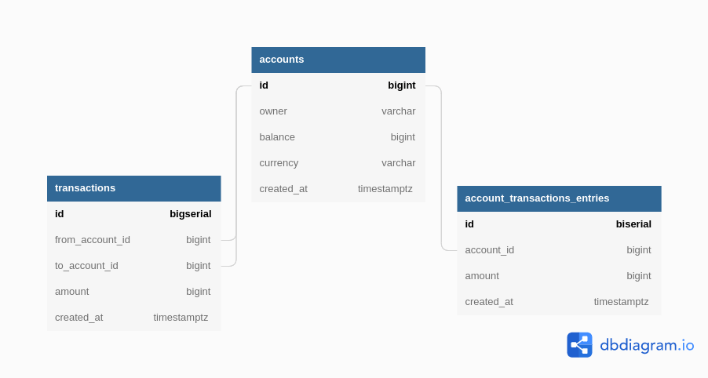

# Bank Server 

## Things to do

- [x] Design Database Schema
      
- [x] Create a postgres instance using docker and docker volume
      using `docker-compose.yaml` file
- [x] Connect to a Postgres instance
- [x] Create Tables In DB using sql file
      Future Improvements:
  - [ ] use SQLC to make queries
- [x] Make CRUD API for accounts table
- [x] Write Unit test for the API's
- [x] Dockerize (create a docker image) for the go app and db
      [See Dockerfile here](Dockerfile)
- [ ] Create Docker Network to let the image connect with the db
      `docker network create bank-network`
      `docker network connect bank-network postgres12`
- [x] Create CI using Github Actions on master branch
- [x] Deploy the image in minikube locally

- [x] Handle Transactions
- [x] Deploy on Kubernetes using AWS EKS
- [x] Add Datree in CI for misconfig checking

- [ ] Setup Monitoring Using Prometheus
- [ ] Read env variables from config file
- [ ] Write Unit Tests by using Mock to mock DB.

### Things I am learning

Dockerfile
Docker Network
